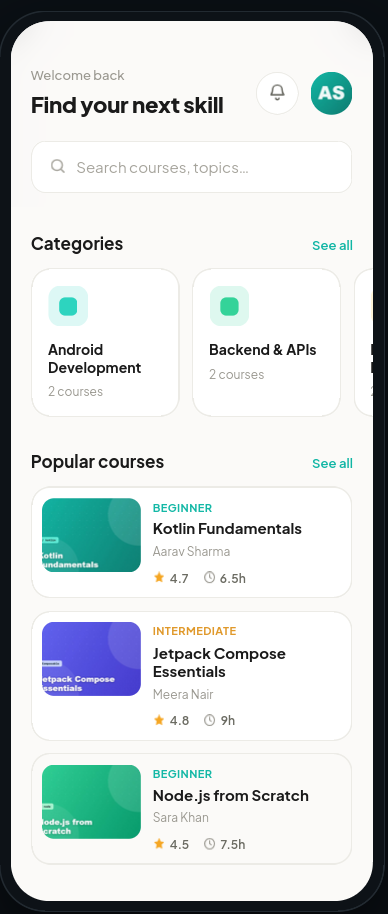
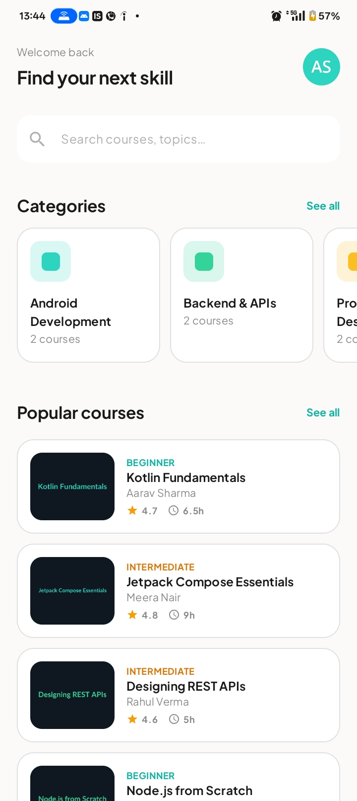
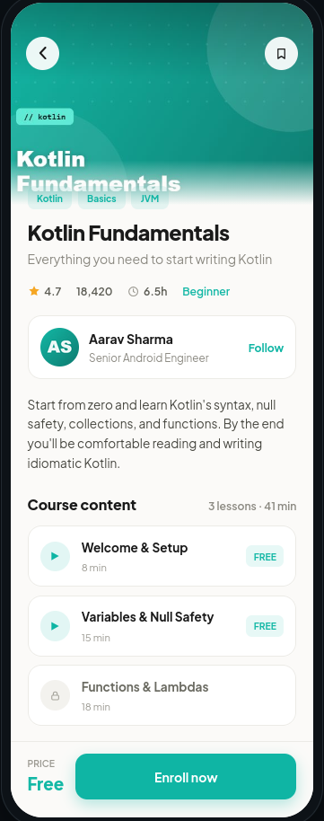
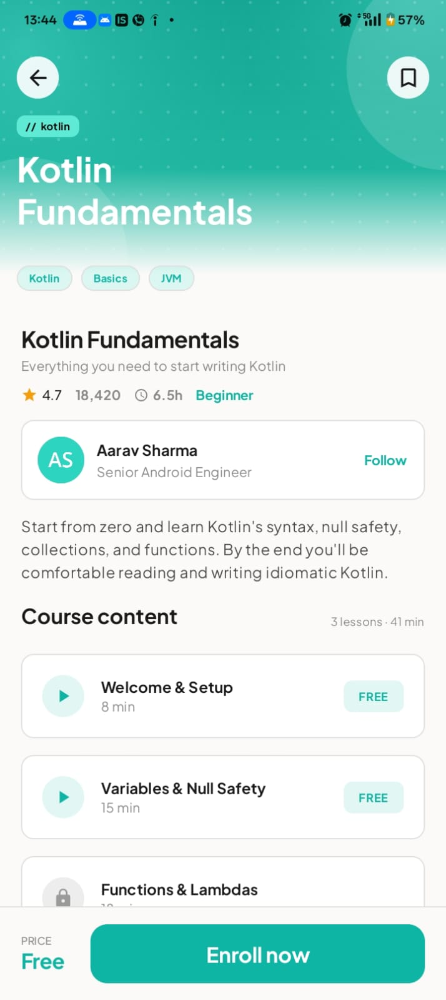
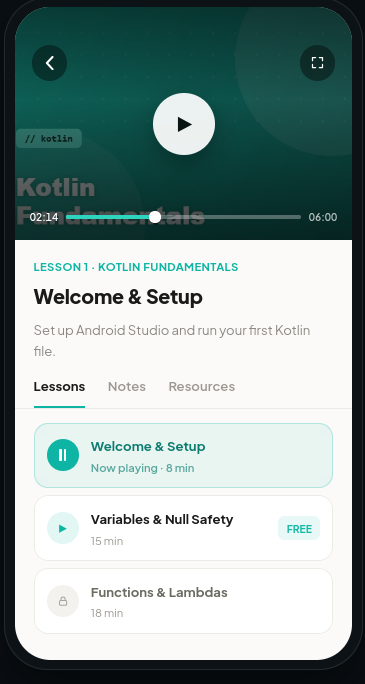
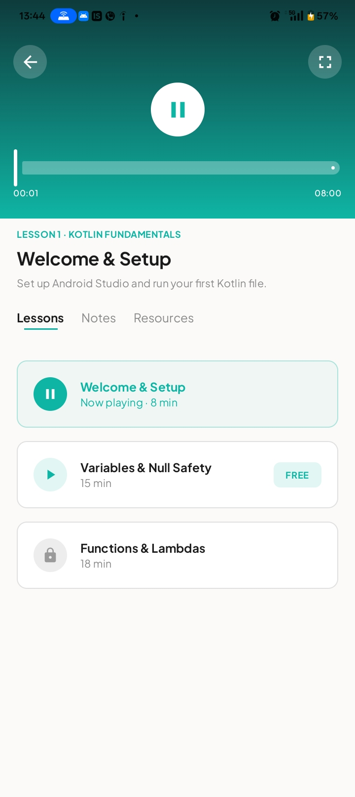

# Skillforge 📱

A lightweight, 3-screen Android learning app built with **Kotlin + Jetpack Compose** as part of an AI-first engineering assessment. The app follows a clean **Browse-to-Learn** flow:

**Home → Course Detail → Lesson Player**

Data is sourced from a single live JSON endpoint:
```
https://raw.githubusercontent.com/android-assesment/notes/refs/heads/main/data.json
```
The API returns a nested structure — `categories → courses → lessons` — and all querying happens on-device after a single fetch.

---

## Design → Build

<table>
<tr>
<th width="280">Design (given)</th>
<th width="40"></th>
<th width="280">Built</th>
</tr>
<tr>
<td></td>
<td align="center">➡️</td>
<td></td>
</tr>
<tr>
<td></td>
<td align="center">➡️</td>
<td></td>
</tr>
<tr>
<td></td>
<td align="center">➡️</td>
<td></td>
</tr>
</table>

---

## How I Used AI

Rather than relying on a single AI assistant, I ran a distributed, multi-model workflow — routing different phases of the build to whichever model was best suited for the task. Prompts were composed using **Wispr Flow** (voice-to-text), which let me speak engineering intent naturally and get it converted into clean, structured prompts without stopping to type everything out.

### AI Tools & Model Breakdown

| Phase | Tool / Environment | Model | What It Did |
|---|---|---|---|
| Architecture & orchestration | Antigravity | Claude (via Anthropic API) | Overall build plan, dependency boundaries, screen-state design, and acting as the high-level orchestrator throughout the project |
| Core code generation | OpenCode | DeepSeek V4 Flash (via OpenRouter / Mistral API) | Scaffolding screens, Retrofit setup, ViewModels, navigation graph, repository layer |
| Frontend & UI polish | Antigravity | Gemini 3.5 Flash / Gemini 3.1 Pro | Component layouts, color tokens, typography, spacing adjustments, payment screen UX |
| Testing | Antigravity CLI + SDK (agent mode) | Gemini | Generating unit tests for HomeViewModel and SkillforgeRepository, mocking network failure states, running the test suite via agents |
| Verification & Git push | OpenCode | GPT OSS 120B (via OpenRouter) | Final code review pass, catching any remaining issues, then pushing the finished code to GitHub |
| Prompt input | Wispr Flow | — | Voice dictation → structured prompts, used across all of the above |

### Actual Prompts I Sent

**Prompt 1 — Fixing the API integration:**
> *"TODO: add prompt"*

**Prompt 2 — Payment flow and lesson unlock:**
> *"TODO: add prompt"*

**Prompt 3 — Offline caching:**
> *"TODO: add prompt"*

### What the AI Got Right

The **offline caching architecture** was implemented correctly on the first attempt. The model understood immediately that we needed to serialise the full API response with `kotlinx.serialization`, write it to `context.filesDir`, and fall back to that file on any network failure — all without restructuring the existing ViewModel layer.

### What the AI Got Wrong — and How I Fixed It

The AI initially hardcoded `course.price() == 0.0` as the check for whether a course was free. This meant **every course appeared unlocked**, regardless of what the API actually said, which silently broke the payment flow.

The fix: classify courses based purely on the `isFree` field on individual lessons, which is what the API actually provides. Once I pointed that out explicitly, the model corrected it cleanly.

### What AI Couldn't Do

Matching the UI **exactly** to the given design — spacing, padding, the small subtle stuff — wasn't something AI could really do on its own. It can't see what's actually being rendered on screen, so when I asked it to fix specific layout details, it was mostly guessing: it would shift one thing and break another, or "fix" a padding value that didn't even need fixing. After a few rounds of that going nowhere, I just did the pixel-level matching myself — comparing the design screenshots against the running app side by side and adjusting spacing/padding manually until it matched.

---

## Getting Started

```bash
git clone https://github.com/theerthkr/SkillForge.git
```

Open in **Android Studio Ladybug** (or newer), let Gradle sync, then run on a device or emulator.

### Running Tests

```bash
# Unit tests
./gradlew test

# Instrumented tests (requires connected device/emulator)
./gradlew connectedAndroidTest
```